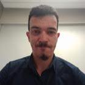

    <h1>🌱 EcoJoinvlle</h1>

# Sobre

O EcoJoinville é um projeto desenvolvido para fins educacionais, com o objetivo de desenvolver páginas web com HTML5, CSS3 e JAVASCRIPT.

A aplicação é constituída por uma Landing Page de cunho informativo e que permite o cadastro de parceiros para a gestão de resíduos em Joinville.

Por se tratar de um projeto desenvolvido para fins de estudo, novas funcionalidades, melhorias de segurança, validações e aprimoramentos de arquitetura podem ser incorporados futuramente.

API de teste: `https://6860899b8e74864084437167.mockapi.io`

# Execução

- Landing page: `http://127.0.0.1:5500/landing-page/`
- Tela de Login de Parceiros: `http://127.0.0.1:5500/login-parceiros`

1. Logue com o e-mail cadastrado e use qualquer senha
2. Será redirecionado para tela de parceiros: `http://127.0.0.1:5500/login-parceiros/listagem-parceiros.html`
3. Pode filtrar os parceiros no campo de pesquisa
4. Clique no parceiro para ver os detalhes

# Contribuidores

<table>
  <tr>
    <td align="center">
       
      <a href="https://github.com/lab365-operacao">LAB365</a>
    </td>
    <td align="center">
       
      <a href="https://github.com/Romanatt0">Victor Romanatto</a>
    </td>
    <td align="center">
       
      <a href="https://github.com/silva-eduardrs">Prof. Eduardo Silva</a>
    </td>
  </tr>
</table>
